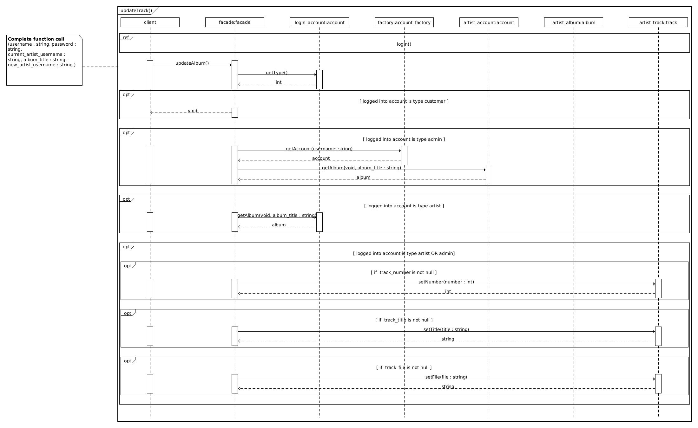

# Record Label 
This project was completed as the submission for my final project with Open University project, here is a selection of the diagrams and code that were created for it. 

> The UML diagrams were created with [UMLet](https://www.umlet.com/), the source files for each of the images shown can be found in the relevant folders.

## Gantt Chart

## Current Activity Diagram

## Current Data Model

## User stories

### Template
|As a||
|---|---|
|I want to||
|So that I||

### Customer
|As a|customer|
|---|---|
|I want to|browse albums by artists|
|So that |I can potentially buy the ones I am interested in|

|As a|customer|
|---|---|
|I want to|buy one or more albums|
|So that |I can download them|

|As a|customer|
|---|---|
|I want to|create an account|
|So that |I can complete a purchase and login in later and re-download the music I have paid for if needed|

### Artist
|As a|artist|
|---|---|
|I want to|upload albums that I have created|
|So that |they can be bought and downloaded by potential customers|

|As a|artist|
|---|---|
|I want to|see how many downloads an album has accrued in a visual format|
|So that |I can gain feedback from fans|

### Label owner
|As a|label owner|
|---|---|
|I want to| create artist accounts|
|So that| artists can upload their music|

|As a|label owner|
|---|---|
|I want to| set the album release date|
|So that| albums are not immediately available when they are uploaded|

|As a|label owner|
|---|---|
|I want to| make changes to an album (track names, images, associated artists|
|So that| errors can be rectified|

|As a|label owner|
|---|---|
|I want to |set the price of the album|
|So that| the label can generate revenue|

|As a|label owner|
|---|---|
|I want to| be able to remove both artist and albums where necessary|
|So that| mistakes are not persistent on the website|

|As a|label owner|
|---|---|
|I want to| get an overview of the most downloaded albums in a visual format|
|So that| marketing and social media presence can be tailored appropriately|

|As a|label owner|
|---|---|
|I want| see the total revenue each month in a visual format|
|So that| an appropriate budget can be created|

## Use Case Diagram

## Album Download Activity Diagram

## Album Upload Activity Diagram

## Class Diagram

## Add Artist Sequence Diagram

## Approve Album Sequence Diagram

## Create Account Sequence Diagram

## Download Album Sequence Diagram

## Log In Sequence Diagram

## Purchase Album Sequence Diagram

## Remove Acccount Sequence Diagram

## Remove Album Sequence Diagram

## Remove ArtistSequence Diagram

## Remove Track Sequence Diagram

## Update Album Sequence Diagram

## Update Track Sequence Diagram

## Upload Album Sequence Diagram

## DB Schema

# Backend PHP code
[Account Factory](03-development/account_factory.php)

[Account Interface](03-development/account_interface.php)

[Admin Account Class](03-development/admin_account.php)

[Album Class](03-development/album.php)

[Artist Account Class](03-development/artist_account.php)

[Customer Account Class](03-development/customer_account.php)

[Database Interface](03-development/database_interface.php)

[Facade Class](03-development/facade.php)

[Proxy Database](03-development/proxy_database.php)

[Purchase Class](03-development/purchase.php)

[Real Database Class](03-development/real_database.php)

[Track Class](03-development/track.php)

## SQL Statements and Table Creations
[CRUD Statements](03-development/crud.sql)

[Table Creations](03-development/tables.sql)
